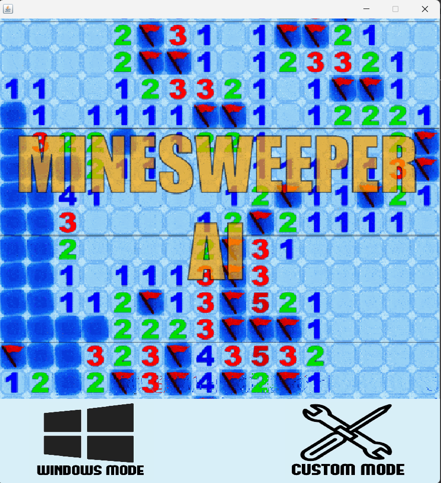
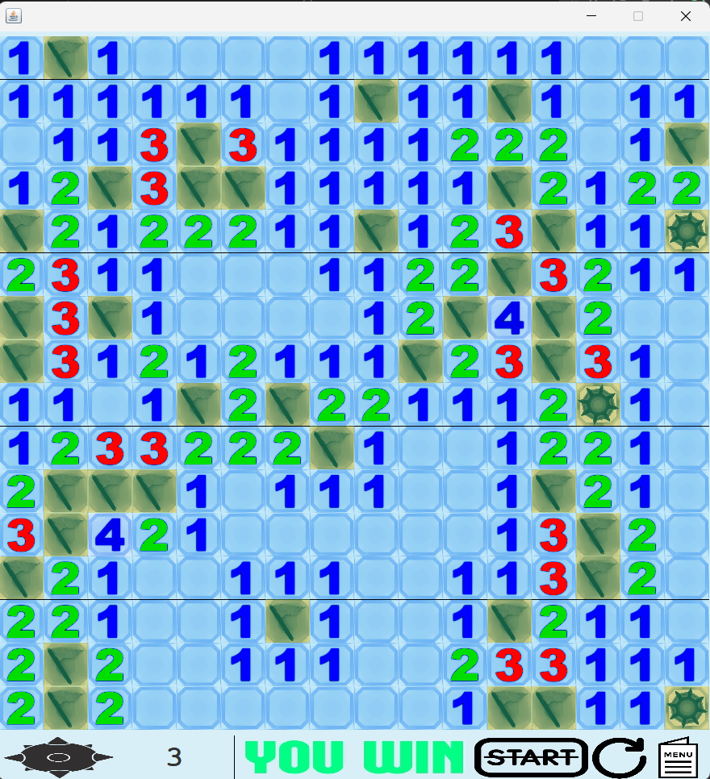
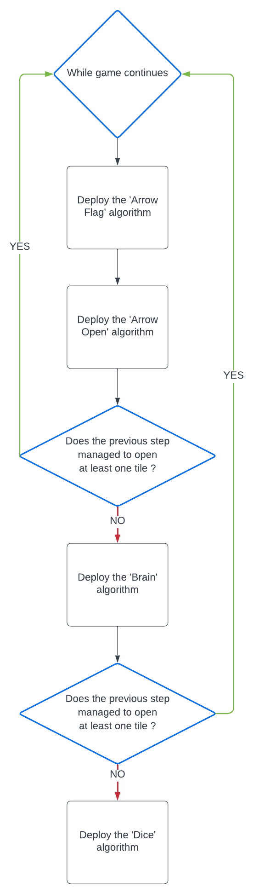

# Minesweeper Playing Agent Utilizing Backtracking Search

## Overview
This project implements a Minesweeper solver that leverages a constraint satisfaction problem (CSP) framework to intelligently navigate through the classic Minesweeper grid. The solver employs backtracking search to iteratively explore the solution space, assigning values to squares based on the current state of the game board and surrounding numerical clues.

## Features
- Windows Mode: Standard configurations following Windows 7 Minesweeper metrics
- Custom Mode: Allows custom board sizes and mine counts
- Intelligent AI solver using CSP and backtracking
- GUI implementation using Java Swing and AWT

## Game Configurations
The typical board configurations include:
- Beginner: 9 × 9 board with 10 mines
- Intermediate: 16 × 16 board with 40 mines
- Expert: 16 × 30 board with 99 mines

## Algorithm Performance
Based on 1000 test instances:
- Beginner Level: 95% success rate
- Intermediate Level: 60% success rate
- Expert Level: 18% success rate

## Implementation Details
The solver uses three main algorithms:

### 1. Arrow Algorithm
- **Arrow Flag**: Places flags where mines are certain (O(N²) complexity)
- **Arrow Open**: Opens squares that are certainly safe (O(N²) complexity)

### 2. Brain Algorithm
- Uses backtracking search as foundation
- Divides squares into information categories
- Creates independent subsets for efficient processing
- Worst-case complexity: O(2^N)

### 3. Dice Algorithm
- Probability-based decision making
- Uses data from backtracking combinations
- Makes educated guesses when certain moves aren't available

## Detailed Algorithm Description

### Arrow Algorithm

The Arrow algorithm has two sub-components:

#### 1. ArrowFlag Algorithm
- Operates with O(N²) complexity
- Scans the entire game matrix to identify definite mine locations
- Counts open and flagged squares around a square
- If the number of mines around a square equals the number of flags and there are still unopened squares, these squares are definitely safe
- The agent's flag placement operations only occur through this algorithm

#### 2. ArrowOpen Algorithm  
- Operates with O(N²) complexity
- Works similar to ArrowFlag logic
- Counts open and flagged squares around a square
- If the number of mines around a square equals the number of flags, all remaining squares are safe and can be opened
- When any square is opened, the Arrow algorithm returns to start and runs again

### Brain Algorithm

If the Arrow algorithm cannot open any squares, the Brain algorithm activates:

1. **Information Gathering Phase:**
   - O(N²) complexity matrix scan is performed
   - Squares are divided into two categories:
     - Squares with known information (at least one neighbor is open)
     - Squares with unknown information

2. **Subset Division:**
   - Squares with known information are divided into independent subsets
   - Two squares are in different subsets if:
     - Opening one doesn't affect information about the other
     - There is no information dependency between them

3. **Backtracking Enumeration:**
   - Backtracking is performed independently for each subset
   - For N total squares, 2^N possible states are checked
   - The following constraints are checked in each state:
     - Total mine count limit
     - Flag map compatibility
     - Open squares map compatibility

4. **Decision Making:**
   - All possible combinations are evaluated
   - If a square is empty in all combinations, that square is opened
   - Returns to Arrow algorithm

### Dice Algorithm

If the Brain algorithm also cannot open squares, the Dice algorithm activates:

1. **Probability Calculation:**
   - Uses backtracking results from the Brain algorithm
   - For each square:
     - Number of combinations containing mines
     - Number of combinations without mines is recorded
   
2. **Sample Calculation:**
   - Total 200 combinations
   - Square A: mine in 50 combinations, empty in 150
   - Square B: mine in 20 combinations, empty in 180
   - Square B is safer choice (10% mine probability vs 25%)

3. **Guess and Result:**
   - Square with lowest mine probability is selected
   - Selected square is opened
   - If a mine is hit, game is lost (only way for agent to lose)
   - If no mine, returns to Arrow algorithm

## Project Structure
- **MainFrame.java**: Main GUI container
- **ImagePanel.java**: Image rendering component
- **MyjButton.java**: Custom button implementation
- **TilePanel.java**: Game tile management
- **Game.java**: Core game mechanics
- **Ai.java**: AI solver implementation
- **GameInterface.java**: Interface between Game and AI components

## Results and Conclusion
The agent performs exceptionally well on the Beginner level, meeting the initial benchmark. Performance on Intermediate and Expert levels falls slightly short of expectations, primarily due to the Dice algorithm's limitations compared to more sophisticated guessing algorithms like Markov chains.

## References
1. [Minesweeper Solver Implementation](https://informatika.stei.itb.ac.id/~rinaldi.munir/Stmik/2021-2022/Makalah/Makalah-IF2211-Stima-2022-K2%20(30).pdf)
2. [Minesweeper Solver Guide](https://www.geeksforgeeks.org/minesweeper-solver)
3. [Minesweeper AI Repository](https://github.com/PatrickGhadban/Minesweeper-AI)
